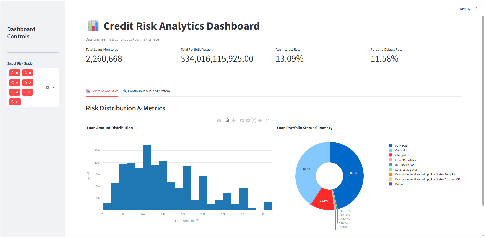
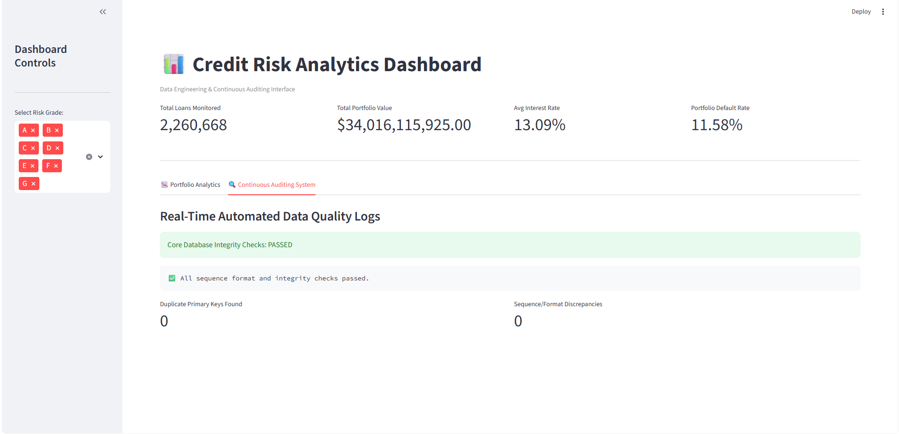

# Credit Risk Analytics Platform
### Data Engineering & Continuous Auditing Interface
## 📊 Dashboard Preview

### Portfolio Analytics

Interactive portfolio monitoring with key credit-risk metrics, risk-grade filtering, loan amount distribution, and portfolio status analysis.

### 🔍 Continuous Auditing System

Automated data-quality monitoring that validates database integrity, detects duplicate primary keys, and identifies sequence or format discrepancies.

